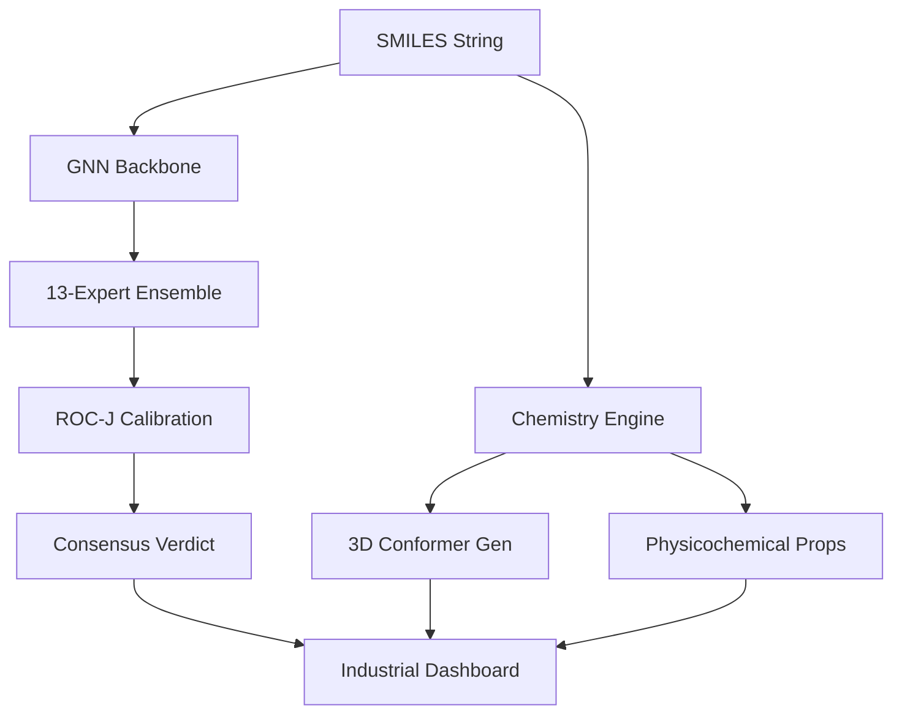

# 🛰️ BioAegis X-Alpha: 13-Expert Toxicity Ensemble

**BioAegis X-Alpha** is an industrial-grade molecular toxicity profiling platform. By orchestrating a high-precision ensemble of **13 independent Graph Neural Network (GNN) specialists**, it provides granular risk assessments across the entire pharmacological spectrum.

---

## 💎 Molecular Command Deck
- **13-Expert Ensemble**: Real-time consensus from 13 independent GNN binary classifiers (Cardiotoxicity, Hepatotoxicity, Mutagenicity, etc.).
- **ROC-J Statistical Hardening**: Every decision boundary is mathematically absolute, derived using **Youden's J-Statistic** for maximum diagnostic power.
- **3D Structural Attribution**: Saliency heatmaps projected onto atom-wise 3D conformers with a **boundary-free deep-zoom (0.001)** viewport.
- **Industrial Emerald UI**: A premium, high-retention dashboard built with Next.js 16 (Turbopack) and Framer Motion.

---

## 🏗️ Technical Architecture

### **1. Neural Core & Startup Protocol**
The GNN architecture utilizes a shared-backbone feature extractor with 13 specialized heads. The engine incorporates a **FastAPI Lifespan Protocol** to ensure the neural core is fully reconstituted (from ASCII or Cloud Hub) and the ROC-J threshold matrix is locked before the gateway opens.

> [!IMPORTANT]
> **HuggingFace Synchronization**: The backend performs a forensic weight audit on boot. If local binaries are missing, it automatically triggers a cloud sync via the `huggingface_hub` to maintain industrial uptime.

### **2. Statistical Pass**
Each expert is linked to a hardened decision matrix derived from ROC analysis of the master pharmacological dataset. This eliminates heuristic bias and ensures a statistically absolute "Pass/Toxic" boundary.

---

## 🚀 Deployment & Usage

### **HuggingFace Infrastructure (Backend)**
The API is deployed as a Dockerized FastAPI node on HuggingFace, providing encrypted high-throughput inference.

### **Vercel Navigation (Frontend)**
The primary research deck is available at:
👉 **[bioaegis-production.vercel.app](https://bioaegis-production.vercel.app/)**

---

## 🛠️ Stack Components
- **Neural Framework**: PyTorch Geometric, RDKit, NumPy (Vectorized ROC-J).
- **Core API**: FastAPI, Uvicorn, Docker.
- **Frontend Deck**: Next.js 16, Tailwind CSS, 3Dmol.js, Framer Motion.

---

### **© 2026 BIOAEGIS DISCOVERY HUB | PHARMACOLOGICAL DISCOVERY NODE**
*Industrial Integrity | Cluster: GNN-PRO-08 | Operational Status: Symmetrical*
